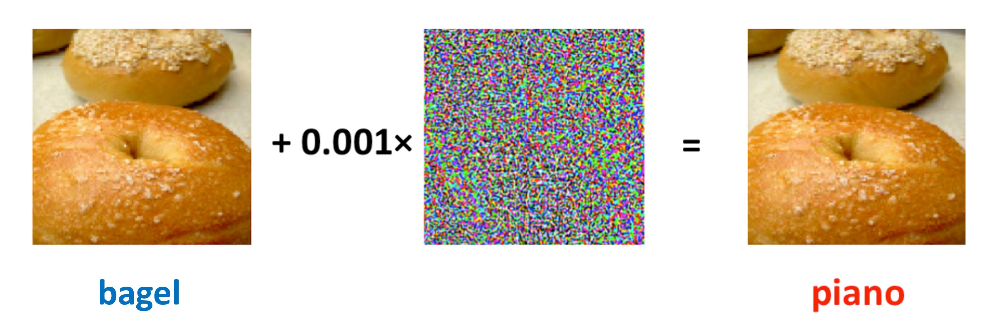

# A Review of Adversarial Attack and Defense for Classification Methods

Authors: [Yao Li](https://liyao880.github.io/yaoli/), [Minhao Cheng](https://cmhcbb.github.io/), [Cho-Jui Hsieh](http://web.cs.ucla.edu/~chohsieh/index.html), [Thomas C. M. Lee](https://anson.ucdavis.edu/~tcmlee/)

## Overview

This paper aims to introduce the topic of adversarial attack and defense, and its latest developments to the statistical community. Computing codes (in python and R) used in the numerical experiments are publicly available for the readers to explore the surveyed methods.  It is the hope of the authors that this paper will encourage more statisticians to work on this important and exciting field of generating and defending adversarial examples.



## Setup

### 1. Prerequisites
- NVIDIA GPU (Tested on Nvidia GeForce RTX 3090)
- CUDA (Tested on CUDA 11.2)
- torch==1.7.1
- art==1.6.0 (adversarial-robustness-toolbox)

### 2. Code Base Structure
The code base structure is explained below: 
- **attack.py**: Code for attack methods: FGSM, PGD, ZOO, OPT attack, Sign-OPT.
- **attack_other.py**: Code for other attack methods: Square, Boundary.
- **train_model.py**: Code for training base model, Random Self-ensemble model, Madry's adversarial training and TRADES.
- **train_ot.py**: Code for training ER-CLA.
- **train_rs.py**: Code for training randomized smoothing model.
- **attack_logistic**: Contains R code for attacking logistic regression model.
- **setup**: Contains definitions for networks, utils of methods etc...

### 3. Training and Evaluation
Here are example commands for trainining and attacking classifiers. Before performing attack or defense, please change `download=False` to `download=True` in ./setup/utils.py to download the data. After that, please set `download=False`.

#### Trainining Defense Models
Train a deep neural network on CIFAR10 without any defense method:
```
python train_model.py -d "cifar10" -f "/model_cifar10" --method "no_defense" --root PATH_TO_THE_DATA
```
Train a RSE model on CIFAR10:
```
python train_model.py -d "cifar10" -f "/model_cifar10_noise" --model "noise" --root PATH_TO_THE_DATA
```
Madry's adversarial training on MNIST:
```
python train_model.py -d "mnist" -f "/model_mnist_madry" --method "madry" --root PATH_TO_THE_DATA
```
TRADES adversarial training on MNIST:
```
python train_model.py -d "mnist" -f "/model_mnist_trades" --method "trades" --root PATH_TO_THE_DATA
```
Train ER-CLA on MNIST:
```
python train_ot.py --dataset "mnist" -file_name "/ot_mnist_" -epochs 60 -root PATH_TO_THE_DATA
```
Train Randomized Smoothing model on CIFAR10
```
python train_rs.py --dataset "cifar10" --epochs 60 --outdir FOLDER_SAVE_MODELS --root PATH_TO_THE_DATA
```
Code for all adversarial detection methods used in experiments can be found at [Github for ReBeL](https://github.com/jayaram-r/adversarial-detection)

#### Attacking Models
Attack a model with PGD/FGSM/ZOO/OPT/Sign-OPT on CIFAR10:
```
python attack.py --dataset 'cifar10' --attack METHOD_NAME 
```
Attack a model with Boundary or Square attack on MNIST:
```
python attack_other.py --dataset 'mnist' --attack METHOD_NAME 
```

## Issues
- Please report all issues on the public forum.
